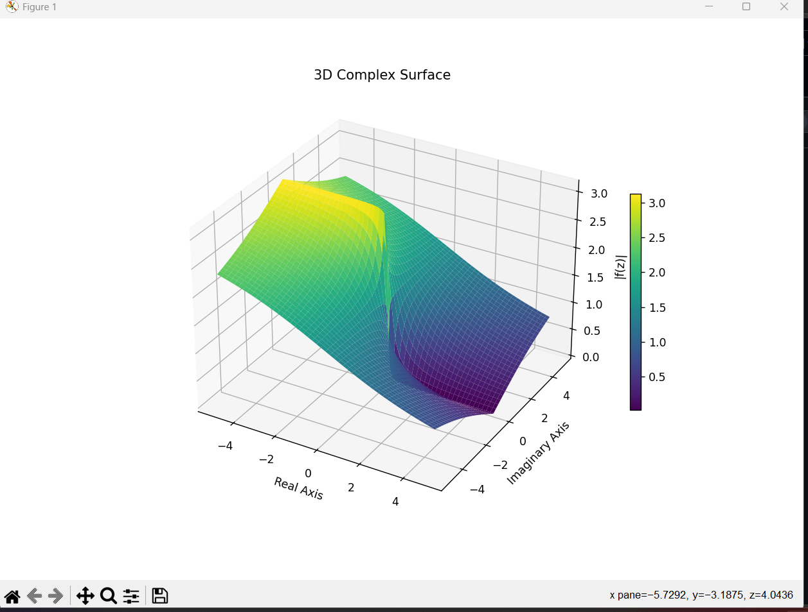

# 3D Complex Visualizer

A Python-based visualization tool to explore complex functions in 3D space.

## 🚀 Features
- Visualizes complex functions f(z)
- 3D surface plotting
- Supports functions like:
  - z
  - z**2
  - np.sin(z)
  - np.exp(z)
- Interactive rotation (Pygame version)

## 🧠 Concept
A complex number is:
z = x + iy

We visualize:
|f(z)| = magnitude of function output

X-axis → Real part  
Y-axis → Imaginary part  
Z-axis → Magnitude  

## 📸 Output



## ⚙️ Installation

```bash
pip install -r requirements.txt
